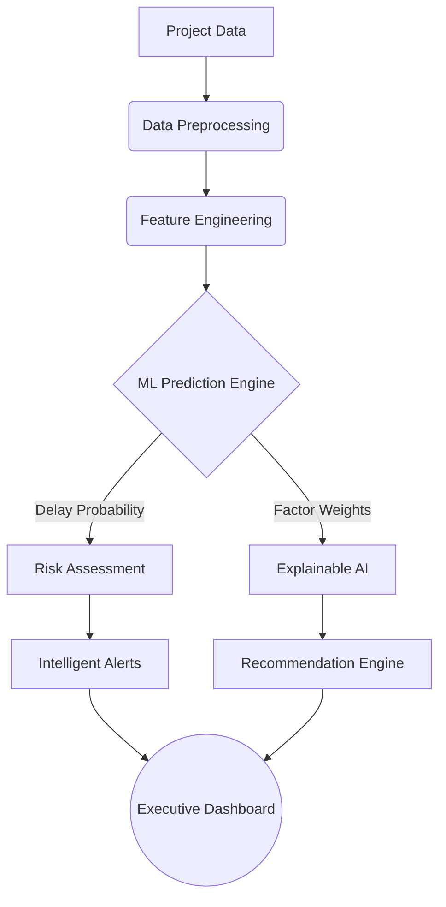
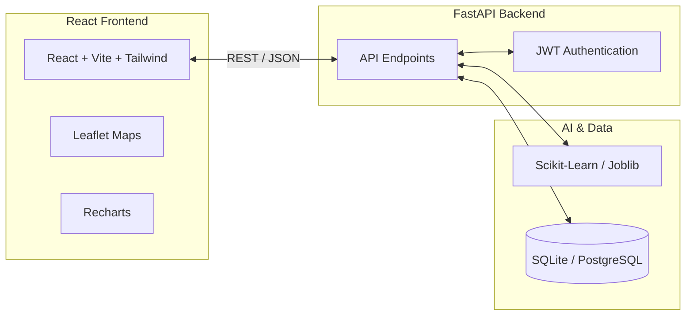

# LandPulse AI

> **Predict Land Acquisition Delays. Prevent Project Bottlenecks.**

LandPulse AI is an enterprise-grade, AI-powered predictive analytics and decision-support platform designed to identify potential delays in land acquisition processes, analyze project risk, explain the reasons behind predicted risks, visualize geographic risk, generate actionable alerts, and recommend preventive interventions.


---

## 📖 Overview

Infrastructure development often faces severe delays due to complex land acquisition processes. LandPulse AI proactively monitors infrastructure projects throughout their lifecycle, utilizing machine learning to predict bottlenecks before they cause significant delays. By analyzing geospatial, financial, legal, and demographic data, the platform provides early warnings and strategic recommendations to ensure projects remain on schedule.

## ⚠️ The Problem

The land acquisition lifecycle spans multiple complex stages—from initial notification and social impact assessment to compensation disbursement and physical possession. Traditional project monitoring is reactive, leading to:

- Unforeseen legal disputes stalling multi-million dollar investments.
- Delays in statutory clearances blocking subsequent acquisition phases.
- Insufficient tracking of rehabilitation and resettlement progress.
- Budget overruns resulting from extended project timelines.

Without predictive intelligence, administrators lack the foresight required to allocate resources effectively and prevent bottlenecks.

## 💡 The Solution

LandPulse AI transitions project monitoring from reactive tracking to proactive intelligence. It ingests multidimensional project parameters and leverages machine learning models (Random Forest, Gradient Boosting, Logistic Regression) to assess the probability of delay, evaluate the risk severity, and present an actionable mitigation strategy.

## ✨ Key Features

- **AI/ML Risk Prediction:** Real-time calculation of delay probability, risk score, and estimated delay duration.
- **Explainable AI (XAI):** Transparent breakdown of the factors contributing to the risk score (e.g., pending clearances, low stakeholder responsiveness).
- **GIS / Geographic Intelligence:** Interactive map plotting of projects color-coded by risk category, powered by Leaflet.
- **Action Recommendation Engine:** Automated, rule-based mitigation strategies targeting specific identified bottlenecks.
- **Intelligent Alerts:** Automated alerts highlighting high-severity issues requiring immediate administrative intervention.
- **Project Lifecycle Tracking:** Granular progress monitoring across all land acquisition stages.
- **Analytics Dashboard:** Executive-level KPI metrics covering state/district trends and delay factors.
- **Model Management:** API endpoints and UI to review current active ML models, accuracy, and training metrics.
- **Role-Based Access Control (RBAC):** Secure access tiers ensuring appropriate data visibility and action capabilities.

## ⚙️ How It Works



## 🧠 AI / Machine Learning

The platform's prediction engine trains and evaluates multiple classification and regression models to determine the optimal active model:

- **Input Features:** Land area, affected families, compensation percentage, approval delay days, legal disputes, documentation status, historical delay scores, and stakeholder responsiveness.
- **Algorithms Evaluated:** Logistic Regression, Random Forest Classifier, Gradient Boosting Classifier (for risk categorization); Random Forest Regressor (for delay duration prediction).
- **Model Output:** Risk Category (LOW, MEDIUM, HIGH, CRITICAL), Delay Probability (%), and Risk Score (1-10).
- **Model Management:** Active models and historical metadata are persisted via `joblib`, enabling performance tracking and retraining capabilities.

### Explainable AI
The XAI module dissects the prediction to answer *"Why is this project at risk?"* It outputs a percentage impact for each feature, categorizing factors as either mitigating (negative impact) or aggravating (positive impact on delay risk). 

## 🗺️ GIS / Geographic Intelligence

Projects are visualized geospatially using React-Leaflet. The map provides:
- Live clustering of infrastructure projects based on geographic coordinates.
- Color-coded risk markers (Red = Critical, Orange = High, Yellow = Medium, Green = Low).
- Interactive popups containing instant summaries of project health, expected completion dates, and risk scores.

## 🔄 Land Acquisition Lifecycle

The system accurately tracks projects across standard acquisition stages:
- Preliminary Notification
- Social Impact Assessment
- Documentation & Survey
- Compensation Disbursement
- Rehabilitation & Resettlement
- Possession
- Final Acquisition

## 🛡️ Risk & Recommendation System

When the ML engine identifies a high-risk project, the recommendation engine maps the specific failing features to actionable administrative interventions:

- **Example 1:** If Legal Disputes > 3 → *Recommend expediting Alternative Dispute Resolution and appointing a dedicated nodal legal officer.*
- **Example 2:** If Rehabilitation < 50% & Stage is Possession → *Recommend fast-tracking basic civic amenities at the resettlement colony.*

## 🔐 Role-Based Access Control

| Role | Purpose | Capabilities |
|------|---------|--------------|
| **Administrator** | Full system control | User management, model retraining, system configuration |
| **State Officer** | State-level oversight | View all state projects, override predictions, acknowledge alerts |
| **District Officer** | District execution | Manage district projects, update progress milestones, upload documents |
| **Project Manager** | Specific project management | Update specific project details, respond to project-level recommendations |
| **Viewer** | Auditing and reporting | Read-only access to dashboards, reports, and map views |

## 🏗️ System Architecture



## 🔌 API Overview

The backend is built with FastAPI, providing robust RESTful endpoints.

| Method | Route | Purpose |
|--------|-------|---------|
| `POST` | `/api/auth/login` | Authenticate user and issue JWT |
| `GET`  | `/api/dashboard` | Fetch aggregated KPIs and system metrics |
| `GET`  | `/api/projects` | List paginated projects |
| `GET`  | `/api/projects/{id}` | Get detailed project data and prediction history |
| `POST` | `/api/predict` | Generate real-time risk prediction from payload |
| `GET`  | `/api/alerts` | Fetch active risk alerts |
| `GET`  | `/api/recommendations` | Get system-generated action recommendations |
| `GET`  | `/api/map/projects` | Fetch GeoJSON feature collection for GIS mapping |
| `GET`  | `/api/model/status` | Retrieve active ML model metrics and metadata |

## 💻 Installation

### Prerequisites
- Python 3.11+
- Node.js 20+

### Setup Instructions

```bash
# 1. Clone the repository
git clone https://github.com/miteshlohar2005/LandPulse-AI.git
cd LandPulse-AI

# 2. Setup Python Virtual Environment
python -m venv .venv
source .venv/bin/activate  # On Windows use: .venv\Scripts\activate

# 3. Install Backend Dependencies
pip install -r requirements.txt

# 4. Generate Demo Data and Train the Initial Model
python scripts/generate_demo_data.py
python ml/train.py

# 5. Setup Frontend
cd frontend
npm install
```

## 🔑 Environment Variables

Copy the `.env.example` to `.env` in the root directory.

| Variable | Purpose | Required |
|----------|---------|----------|
| `PROJECT_NAME` | Name of the application instance | Yes |
| `SECRET_KEY` | Key for JWT token generation | Yes |
| `DATABASE_URL` | Connection string (SQLite or PostgreSQL) | Yes |
| `PORT` | Backend API port (default 8000) | Yes |

*Note: Never expose actual API keys, JWT secrets, or database credentials in public repositories.*

## 🚀 Running Locally

Open two separate terminal windows.

**Terminal 1: Backend**
```bash
# Ensure virtual environment is active
uvicorn backend.app.main:app --host 0.0.0.0 --port 8000 --reload
```

**Terminal 2: Frontend**
```bash
cd frontend
npm run dev
```

The frontend will be available at `http://localhost:5173` and the backend at `http://localhost:8000`.

## 📚 API Documentation

Once the backend is running, FastAPI automatically generates documentation interfaces:
- **Swagger UI:** `http://localhost:8000/api/docs`
- **ReDoc:** `http://localhost:8000/api/redoc`

## 🧪 Testing

The platform uses `pytest` for backend and API testing, covering health checks, authentication, data endpoints, and ML predictions.

```bash
# Run the test suite
pytest tests/
```

## 🐳 Docker

The repository includes a multi-stage `Dockerfile` and `docker-compose.yml` for containerized deployment. The build process automatically installs dependencies, builds the React frontend, trains the baseline ML model, and exposes the system on port 8000.

```bash
# Build and run the containers in detached mode
docker-compose up -d --build
```

## 📸 Screenshots

*Screenshots can be added here.*

## 🎯 Use Cases

LandPulse AI is designed to monitor a variety of complex infrastructure developments:
- **Highways & Expressways:** Managing linear acquisition across multiple districts.
- **Railways:** Tracking complex alignment and clearance procedures.
- **Irrigation Projects:** Managing vast areas requiring extensive rehabilitation.
- **Industrial Corridors & Mining:** Assessing high-value commercial impact zones.
- **Renewable Energy Projects:** Monitoring land possession for large-scale solar/wind parks.

## 🚀 Future Improvements (Future Scope)

- **Deep Learning Enhancements:** Integration of neural networks for complex non-linear risk factor analysis.
- **Satellite Imagery Integration:** Utilizing Earth observation data to verify physical possession and rehabilitation site progress.
- **Real-Time Integration:** Connecting directly with state-level land registry APIs for live data ingestion.
- **Generative AI Reports:** Automated generation of detailed monthly administrative PDF briefs using LLMs.

## 📊 Data & Limitations

**IMPORTANT:** The current repository utilizes synthetic/demo data generated via `scripts/generate_demo_data.py` for development, testing, and demonstration purposes.

Predictions, geographical coordinates, and project details are simulated. Production deployment requires integration with real institutional databases, and the machine learning models must be retrained on authenticated historical records before influencing actual administrative decisions.

## 🔒 Security Considerations

- **Authentication:** Token-based authentication using JSON Web Tokens (JWT).
- **Authorization:** Granular Role-Based Access Control enforced at the API route level.
- **Environment Isolation:** Sensitive configurations managed exclusively via environment variables.
- **Secret Management:** Hardcoded credentials are strictly avoided. Ensure secure secret injection in production environments (e.g., via Docker secrets or cloud provider key management).

## 🤝 Contributing

1. Fork the repository.
2. Create your feature branch (`git checkout -b feature/AmazingFeature`).
3. Commit your changes (`git commit -m 'Add some AmazingFeature'`).
4. Push to the branch (`git push origin feature/AmazingFeature`).
5. Open a Pull Request.

## 📄 License

*This project currently does not contain a license file. A standard open-source license (such as MIT or Apache 2.0) should be added prior to production deployment or broader distribution.*

## 👨‍💻 Developer

**Mitesh Ramesh Lohar**
- GitHub: [https://github.com/miteshlohar2005](https://github.com/miteshlohar2005)
- LinkedIn: [https://www.linkedin.com/in/mitesh-ramesh-lohar/](https://www.linkedin.com/in/mitesh-ramesh-lohar/)
